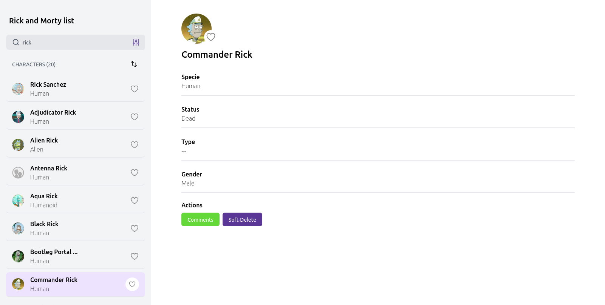

## Instalacion

```bash
  npm install 
  npm run dev
```

## Features

- search for a graphql service
- filter the search
- add comments to each character
- runs a soft delte on the characters

## Tech Stack

**Client:** React, Typescript, TailwindCSS, graphql, jest, testing-library

## Screenshots


